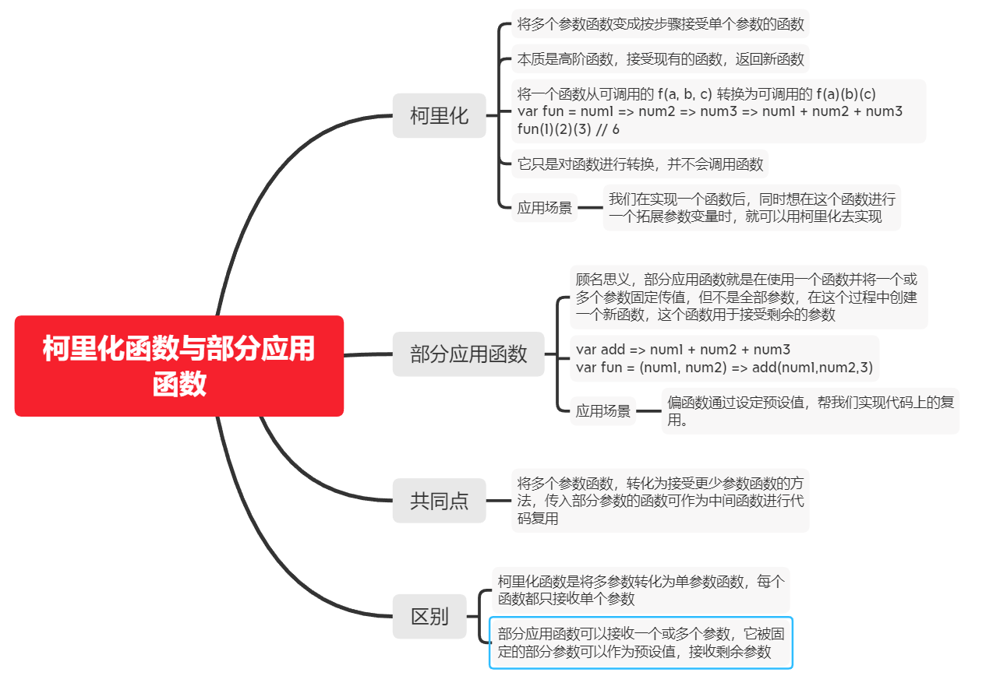
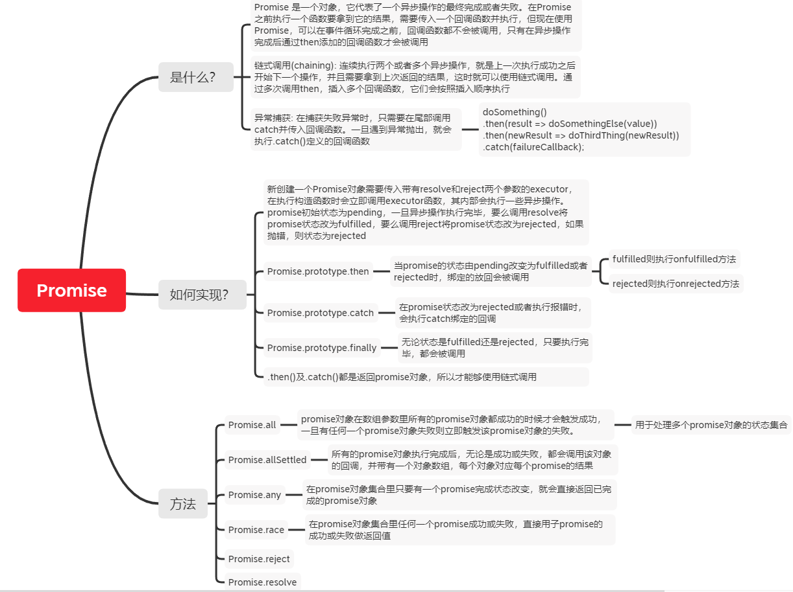
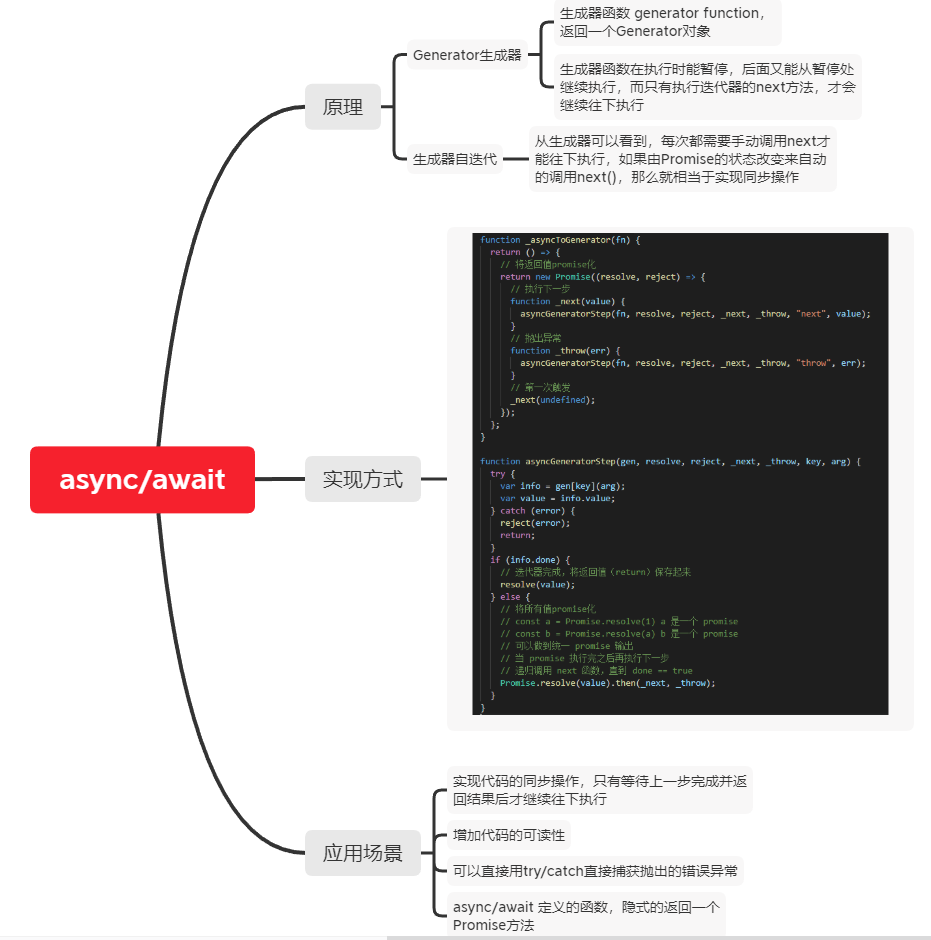

# 面试题库

- [1. Map、Set 和 WeakMap、WeakSet 有什么区别？Weak 的使用场景是什么？](#1)
- [2. 一直 Pending 的 Promise 会不会导致内存泄漏？](#2)
- [3. 在 Javascript 中什么情况下会进行装箱/拆箱转换？](#3)
- [4. 如何区分 null 和 undefined，我应该怎么使用？](#4)
- [5. new 操作符做了什么？模仿实现一个 create 函数](#5)
- [6. JavaScript 严格模式下有哪些不同？ ES6 还需要严格模式吗？](#6)
- [7. 模仿实现一下 ES6 的 class 继承。支持静态成员、super 等等](#7)
- [8. **proto** 是什么？ Function.prototype 是什么？两者有什么关系？](#8)
- [9. 什么是 instanceof，怎么实现 instanceof](#9)
- [10. 谈谈 JavaScript 的作用域。JavaScript 有块作用域吗？ES6 的 let 和 const 做了哪些改进？说说函数声明的作用域](#10)
- [11. 说一说 JavaScript 的类型转换？](#11)
- [12. 说一说字符串编码](#12)
- [13. 字符串为什么不可变？](#13)
- [14. a.x = a = {n: 2} a.x 等于什么？](#14)
- [15. 0.1 + 0.2 === 0.3 // false](#15)
- [16. toPrecision vs toFixed](#16)
- [17. 说一说 JavaScript 尾递归优化](#17)
- [18. 说一说函数柯里化和部分应用](#18)
- [19. 什么是 Promise, 实现 Promise](#19)
- [20. 说一说 async/await 的原理](#20)
- [21. 说一说 Generator 生成器 ，它是协程吗？](#21)
- [22. 说一下 Symbol 使用场景是什么？](#22)

<br>
<br>
<br>

## 题解

<h3 id="1">1. Map、Set 和 WeakMap、WeakSet 有什么区别？Weak 的使用场景是什么？</h3>

Set 类似于数组，成员值不能重复，可以遍历，含有 keys(), values(), entries(), forEach() 方法

WeakSet 的成员只能是对象，对象都是弱引用，因此它无法遍历，不含有 keys(), values(), entries(), forEach() 方法

Map 类似于集合，可以把各种类型的值(包括对象)当做 key，可以遍历

WeakMap 只接受对象作为键名(null 除外)，无法遍历，键名所指向的对象，不计入垃圾回收机制

使用场景：

- 订阅者引用。我们通常使用对象来保存订阅者，当订阅者不再使用时，由订阅者手动释放。但是如果忘记释放就会导致内存泄漏。
- 实现缓存。没有被使用的对象自动释放。
- 保存其他同样也是 Weak 的资源。比如保存 DOM 对象，这些 DOM 对象随时可能被删除。

<br>
<br>

<h3 id="2">2. 一直 Pending 的 Promise 会不会导致内存泄漏？</h3>

<br>
<br>

<h3 id="3">3. 在 Javascript 中什么情况下会进行装箱/拆箱转换？</h3>

<br>
<br>

<h3 id="4">4. 如何区分 null 和 undefined，我应该怎么使用？</h3>

<br>
<br>

<h3 id="5">5. new 操作符做了什么？模仿实现一个 create 函数</h3>

new 操作符用于创建一个用户自定义对象或包含构造函数的内置对象。new 操作符只能作用在函数表达式上(括号可以省略)。

具体过程如下：

- 创建一个空对象，尚且称为 self。
- 连接 self 对象的原型对象到 构造函数(例如 Foo) 的 prototype(可以认为是原型模板)
- 以 self 作为 this (上下文) 调用构造函数 Foo
- 神奇的(不合理的)一步。`如果构造函数返回一个对象(非原始类型、null、undefined)，这个对象将作为 new 操作符的结果`。正常情况下 构造函数都是没有返回值的。

上面第四步是 JavaScript 中设计的不合理的地方，其他编程语言构造函数都是不能显式返回值的:

```jsx
function Foo() {
  this.bar = 1;

  return {};
}

Foo.prototype.baz = 2;

const a = new Foo();
console.log(a.bar); // undefined
console.log(a.baz); // undefined
```

在 ES6 的 class 中这种行为还是被允许的。不过你在 Typescript 下面使用 class 构造函数返回类型不兼容的值会报错。

另外在 ES6 之后的标准中，我们可以通过 `new.target` 来判断当前函数是否以 new 操作符的函数调用的。如果你的函数只能以构造函数的形式调用，可以抛出异常。

```jsx
function create(Ctor, ...args) {
  const self = {};
  Object.setPrototypeOf(self, Ctor.prototype);
  const rtn = Ctor.apply(self, args);
  return typeof rtn === "object" && rtn != null ? rtn : self;
}
```

<br>
<br>

<h3 id="6">6. JavaScript 严格模式下有哪些不同？ ES6 还需要严格模式吗？</h3>

ES6 的模块自动采用严格模式

1. 禁止使用未声明的全局变量
2. 禁止使用 with 语句
3. 除了全局作用域和函数作用域，严格模式创设了第三种作用域：eval 作用域，变量作用范围只在 eval 函数内
4. 禁止 this 指向全局对象
5. 禁止在函数内部遍历调用栈
6. 禁止删除变量，只有在 configurable 设置为 true 的对象属性时，才能被删除
7. 禁止对只读属性进行赋值
8. 禁止对 getter 方法读取的属性进行赋值
9. 对禁止拓展的对象添加新属性时报错
10. 禁止删除不可删除的属性
11. 对象不能有重名属性
12. 函数不能有重名参数
13. 禁止八进制表示法
14. 不允许对 arguments 进行赋值
15. arguments 不再追踪参数变化
16. 禁止使用 arguments.callee，无法在匿名函数内部调用自身
17. 函数声明必须在顶层
18. 新增保留字：implements, interface, let, package, private, protected, public, static, yield

<br>
<br>

<h3 id="7">7. 模仿实现一下 ES6 的 class 继承。支持静态成员、super 等等</h3>

使用 ES5 来实现类的继承：通过原型或原型链的赋值，与 call/apply 方法混用

```js
var __extends = (function () {
  var extendStatics = function (d, b) {
    extendStatics =
      Object.setPrototypeOf ||
      ({ __proto__: [] } instanceof Array &&
        function (d, b) {
          d.__proto__ = b;
        }) ||
      function (d, b) {
        for (var p in b) if (b.hasOwnProperty(p)) d[p] = b[p];
      };
    return extendStatics(d, b);
  };
  return function (d, b) {
    extendStatics(d, b);

    function __() {
      this.constructor = d;
    }
    d.prototype =
      b === null ? Object.create(b) : ((__.prototype = b.prototype), new __());
  };
})();

var Animal = (function () {
  function Animal(name) {
    this.name = name;
  }
  Animal.prototype.move = function (num) {
    if (num == void 0) {
      num = 0;
    }
    console.log("Animal move " + num + " m.");
  };
  return Animal;
})();

var Snake = (function (_super) {
  __extends(Snake, _super);

  function Snake(name) {
    return _super.call(this, name) || this;
  }
  Snake.prototype.move = function (num) {
    if (num == void 0) {
      num = 5;
    }
    console.log("Slithering...");
    _super.prototype.move.call(this, num);
  };
  return Snake;
})(Animal);

var a = new Snake("test");
```

<h3 id="8">8. __proto__ 是什么？ Function.prototype 是什么？两者有什么关系？</h3>

`__proto__` 是 JavaScript 对象的一个非标准的内部字段，在很多文档都称为 `[[Prototype]]` ，现代浏览器都支持通过 `Object.getPrototypeOf` 来获取这个字段。

JavaScript 的对象通过`原型链`(一个链表结构)来查找属性，`__proto__` 相当于链表的 '`next`'。JavaScript 首先在当前对象中查找，如果没有找到则向下查找 `__proto__`， 以此类推。直到 `__proto__` 为 null 或 undefined。

例如，一个 plain object：

```jsx
a = {}; // 等价于 new Object()
a.__proto__ === Object.prototype; // true
Object.prototype.__proto__ === null; // true
```

plain object 等价于 `new Object` , 我们发现创建的对象的 `__proto__` 等价于其构造函数的 `prototype`. 这也就是函数 prototype 属性的作用。

当函数以 new 操作符形式构造对象时，它的 prototype 将成为对象的 `__proto__` 。

所以，假如我们要实现‘类继承‘，例如 Foo 继承 Bar， 我们得让以下等式成立:

```jsx
Foo.prototype.__proto__ -> Bar.prototype
```

那，如果对象修改了 `__proto__` 中的属性，岂不会导致 prototype 也被修改？

实际上并不会。属性重新设置，或者在方法中变更某个属性并不会影响到 prototype。这些变更保存在当前对象(this)上:

```jsx
function Foo() {}
Foo.prototype.a = 1;

const foo = new Foo();
foo.a = 2;
foo.a === 2; // true, 属性变更直接保存在 this 上，不会影响原型
foo.__proto__.a === 1; // true
```

通过 Object.create 可以方便地实现继承:

```jsx
Rectangle.prototype = Object.create(Shape.prototype); // 创建一个对象，这个对象的 __proto__ 指向 Shape.prototype
// 关于 constructor 是另外一个问题
Rectangle.prototype.constructor = Rectangle;
```

当然对象可以不需要 `__proto__` 。我们创建的对象默认都是继承 Object 的, 所以我们才可以访问 toString、isPrototypeOf 等方法。我们可以将 `__proto__` 设置 为 null，创建一个‘纯净’ 的对象：

```jsx
const a = {};
a.__proto__ = null;
a.toString(); // Error

// 更标准的方法是：
a = Object.create(null);
// 或
Object.setPrototypeOf(a, null);
```

拓展： 创建‘纯净’对象

创建空对象的方式有三种：var obj1 = {}; var obj2 = Object.create(null); var obj3 = new Object();

但只有一种可以创建纯净的空对象：Object.create(null)，为什么是纯净呢？因为这样创建出来的对象绝对没有属性，甚至是构造函数、toString、hasOwnProperty 等属性

<h3 id="9">9. 什么是 instanceof，怎么实现 instanceof</h3>

<h3 id="10">10. 谈谈 JavaScript 的作用域。JavaScript 有块作用域吗？ES6 的 let 和 const 做了哪些改进？说说函数声明的作用域</h3>

<h3 id="11">11. 说一说 JavaScript 的类型转换？</h3>

<h3 id="12">12. 说一说字符串编码</h3>

[说一说字符串编码](https://www.notion.so/JavaScript-906cc8deb6e84bf78f20eb961e44fd00)

<h3 id="13">13. 字符串为什么不可变？</h3>

JavaScript 中的原始值（undefained、null、boolean、string、number）与引用值（object，array，function 等）有着根本的区别。

JavaScript 规范定义字符串就是一个原始类型，这是其不可变的表现原因。

- 安全性考虑
- 因为字符串是不可变的，适合用于一些索引值

参考：https://www.notion.so/f6cd0ee471ac4e1abe29d80099e43c77

<h3 id="14">14.  a.x = a = {n: 2}  a.x 等于什么？</h3>

从上题的 `引用值` 的存储方式可以看出，对象的存储是栈中存储指针，指针指向堆中地址，然后对象的赋值是指向新的存储空间。

`a.x = a = {n: 2}` 如果在 a 对象未定义的时候，a.x 是直接抛错。所以我们先操作 `var a = {n:1}; var b = a` 方便我们下面操作的理解。

首先我们先获取等号左侧的 a.x，但 a.x 并不存在，于是 JS 为（堆内存中的）对象创建一个新成员 x，这个成员的初始值为 undefined；

创建完成后，目标指针已经指向了这个新成员 x，并会先挂起，等到等号右侧的内容有结果了，便完成赋值。

接着执行赋值语句的右侧，发现 `a={n:2}` 是个简单的赋值操作，于是 a 的新值等于了{n:2}，指针指向了新的存储地址。但前面的 a 与现在的 a 不一样了，前面的 a.x 是有指向地址但未赋值，所以在完成赋值后，a.x 所指向地址会与后面生成的 a 对象栈中存储的地址相同，指向同一堆中数据，所以可以理解为 `a.x === undefined // true` , `b.x === a // true`

参考: https://www.notion.so/a-x-a-n-2-a-x-f5868dcaac62449983bbe1c4e55d410b

```js
var a = { n: 1 };
var b = a; // b 与 a 指向同一存储空间
/*
 * 首先 a.x = undefined，于是指向同一存储的 b， b.x 也是 undefined；
 * 接着 a = {n: 2}， a 赋予新值，a.x 与之无关，同理并不影响 b.x
 * 然后赋值 b = {n: 1, x: a}, 但 a.x 还是 undefined
 */
a.x = a = { n: 2 };
```

<h3 id="15">15. 0.1 + 0.2 === 0.3 // false</h3>

<br>
<br>
<br>
<h3 id="16">16. toPrecision vs toFixed</h3>

toFixed 会返回指定小数点后位数，123.23.toFixed(1) // 123.2

toPrecision 会返回指定有效位数，如果指定的位数小于整数位，会出现科学计数；如果指定位数大于有效位，则会在末尾补 0

toFixed 参数在 0-100 之间; toPrecision 参数在 1-100 之间

```js
(123.23).toPrecision(1); // 1e+2
(123.23).toPrecision(6); // 123.230
```

<br>
<br>

<h3 id="17">17. 说一说 JavaScript 尾递归优化</h3>

### 什么是尾调用

首先说下什么是尾调用？ 尾调用就是指某个函数的最后一步是在调用另一个函数。举个简单的栗子：

```js
function a(x) {
  return b(x);
}
```

上面中的代码，a 函数中直接返回函数 b 的执行，就是尾调用。其实尾调用不是指出现在函数的尾部，而是指最后一步执行。

```js
function a(x) {
  if (x > 0) {
    return b(x);
  }
  return c(x);
}
```

尾调用特殊是因为其特殊的调用位置，所有函数执行的过程都会有一个入栈与出栈的过程。函数调用会在内存中形成一个 `调用栈` ，用来保存调用位置及内部变量等信息。如果函数 a 内部调用函数 b，那么调用栈会先记录 a 的信息，然后在记录 b 的信息，等 b 函数执行返回到 a 时，b 的信息才会在调用栈中出栈；如果在 b 函数中还执行 c 函数，那么同样在 b 的记录信息上记录着 c 函数的信息，以此类推。

而尾调用由于是函数的最后一步操作，所以不需要保留上层函数的调用记录，因为调用信息都不会再用到，只要直接用内层函数的调用记录，取代外层函数的调用记录就可以。

### 尾递归

函数调用自身称为递归，尾部调用自身的话，就是尾递归了。

递归非常的消耗内存，因为递归执行的同时，会保存每一次的递归信息，很容易就发生 `栈溢出` 错误。但对于尾递归来说，只存在一个调用记录，所以不会出现 `栈溢出` 。

```js
function factorial(n) {
  if (n === 1) return 1;
  return n * factorial(n - 1);
}

factorial(5); // 120
```

上面的递归没有使用尾递归，所以在每次执行 factorial 函数时，都需要保存 n 的值及结果值，当 n 足够大的时候就可能会出现 `栈溢出` 。

如果做以下改动的话：

```js
function factorial(n, total) {
  if (n === 1) return total;
  return factorial(n - 1, total * n);
}

factorial(5); // 120
```

改动成尾递归后，只会保留一个调用记录，复杂度 O(1)，这就是尾递归优化。

### 缺点

- 尾递归能够在死循环的情况下也不会报出 `栈溢出` 的错误，所以有时候难以辨别。
- 调用栈内没有存储信息的话，在调试的过程中是比较困难的。

参考: [说一说尾递归优化](https://www.notion.so/60161244e8384a79b5c388ec12071716)

<br>
<br>

<h3 id="18">18. 说一说函数柯里化和部分应用</h3>



<br>
<br>

<h3 id="19">19. 什么是 Promise, 实现 Promise</h3>



参考:

- [图解 promise](https://zhuanlan.zhihu.com/p/58428287)
- [什么是 Promise](https://www.notion.so/Promise-Promise-b0bffd0c5c9848d191e885bd513ff193)

<br>
<br>

<h3 id="20">20. 说一说 async/await 的原理</h3>



参考:

- [async/await 源码实现](https://juejin.im/post/5da5dc0b5188251189134b47#heading-0)
- [async/await](https://www.notion.so/async-await-8f649420dbb946f8ba8b8c12190a9c6f)
